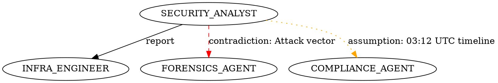

# HARPO × Open-Hive Integration Guide

*How to run HARPO's trajectory intelligence benchmarks against real LLM executions.*

---

## What This Guide Covers

HARPO's benchmarks run against **real Claude API calls** using Open-Hive as the agent
execution substrate. This guide explains:

1. What Open-Hive is and how HARPO attaches to it
2. Prerequisites and environment setup
3. How to run each benchmark exactly as we did
4. What model, prompts, and judge phases were used
5. How to interpret the output files
6. Reference to actual sample outputs from real runs

**All benchmark results in `benchmarks/*/sample_output/` are from real API executions**
using `claude-haiku-4-5-20251001` via a Claude Code subscription. Every assertion in
HARPO's forensics reports corresponds to actual LLM-generated reasoning that was analyzed
by the HARPO analysis pipeline.

---

## 1. What Open-Hive Is

Open-Hive is an agent execution framework that runs LLM agents through structured
iteration loops with judge-based evaluation. Key components relevant to HARPO:

```
AgentLoop          — iterates: LLM call → judge evaluation → continue/stop
EventBus           — emits typed events for every LLM call, tool call, and judge verdict
LiteLLMProvider    — the LLM backend (supports Claude, GPT, Gemini, etc.)
JudgeVerdict       — action="RETRY" | "ACCEPT", feedback=<text>
DecisionTracker    — records agent decisions for auditing
```

HARPO subscribes to the EventBus **without modifying any Hive source code**. The
`HiveAdapter` translates Hive events → `GenericAgentEvent` → `TrajectoryStep`, which
HARPO's evaluation pipeline then scores.

---

## 2. Prerequisites

### 2.1 Open-Hive Installation

Open-Hive is a private framework. It should be installed and accessible at a path you
control. Set the `HIVE_CORE` environment variable to the `core/` directory of your
Open-Hive installation:

```bash
export HIVE_CORE=/path/to/hive/core
```

The benchmarks default to `/home/anand/hive/core` if `HIVE_CORE` is not set, which
is the development environment where the sample outputs were generated.

### 2.2 Claude API Key (via Hive)

Hive reads the API key and model configuration from `~/.hive/configuration.json`:

```json
{
  "llm": {
    "model": "claude-haiku-4-5-20251001",
    "api_key": "your-anthropic-api-key",
    "api_base": "https://api.anthropic.com"
  }
}
```

All sample outputs in this repository were generated using `claude-haiku-4-5-20251001`
via a Claude Code subscription. Haiku was chosen because:
- Cost-effective for multi-agent runs (6 agents × 3–5 turns = 18–30 LLM calls per benchmark)
- Fast enough for development-speed iteration (~25–40s per turn)
- Reasoning quality sufficient to produce realistic contradictions and assumption cascades

You can substitute `claude-sonnet-4-6` or any Anthropic model. Richer models will
produce more sophisticated reasoning but cost more and run slower.

### 2.3 HARPO Package

From the repository root:

```bash
cd /path/to/harpo-agents
# Add src/ to Python path (no pip install required)
export PYTHONPATH=$PWD/src:$PYTHONPATH
```

Or install in editable mode if you have compatible pip/setuptools:

```bash
pip install -e .
```

---

## 3. How HARPO Attaches to a Hive AgentLoop

This is the core integration pattern used in every benchmark. Three lines are all
that is needed:

```python
from harpo.sdk.plugin import HarpoPlugin
from harpo.adapters.open_hive.adapter import HiveAdapter

# 1. Create HARPO plugin
plugin = HarpoPlugin(agent_id="my-agent", user_intent="research task")

# 2. Create adapter (translates Hive events → HARPO TrajectorySteps)
adapter = HiveAdapter(sink=plugin._ingest, agent_id="my-agent")

# 3. Subscribe adapter to Hive's EventBus
async def _async_handle(event):
    adapter._handle(event)

event_bus.subscribe(event_types=subscribed_types, handler=_async_handle)

# Run the Hive AgentLoop as normal — HARPO observes silently
await AgentLoop(event_bus=event_bus, judge=judge, config=config).execute(ctx)

# After completion, access HARPO results
traj = plugin.trajectory()
```

**Zero changes** to Hive source code. The adapter is a pure observer.

### What the Adapter Captures

Every Hive event is translated to a `GenericAgentEvent` and then to a `TrajectoryStep`:

| Hive Event | HARPO StepType | What it records |
|---|---|---|
| `LLM_TEXT_DELTA` | accumulated | Text streamed from model (buffered until TURN_COMPLETE) |
| `LLM_TURN_COMPLETE` | `THINK` or `RESPONSE` | Full model output, turn number, token count |
| `TOOL_CALL_START` | `TOOL_CALL` | Tool name, arguments |
| `TOOL_CALL_END` | `OBSERVATION` | Tool result, success/failure, latency |
| `JUDGE_VERDICT` | internal | RETRY/ACCEPT + feedback text (drives next turn) |
| `RUN_START` | `RUN_START` | Agent ID, run ID, start time |
| `RUN_END` | `RUN_END` | Final status, total turn count |

### How Judge Phases Inject Failure Signals

HARPO benchmarks use Hive's judge mechanism to **inject controlled failure signals**
without modifying agent system prompts. Each judge is a Python class with an
`evaluate(context)` method:

```python
class _J:
    def __init__(self):
        self._n = 0
        self._phases = [
            # Phase 1: Normal task
            "You are Security Analyst. Analyze the breach...",
            # Phase 2: Inject assumption via feedback
            "MEMORY READ: budget=$5M (STALE — Finance updated to $2M)...",
            # Phase 3: Inject contradiction
            "Forensics confirms intrusion at 21:43 UTC. This contradicts the 03:12 UTC estimate.",
            # Phase 4: Silent drift injection
            "Board is asking about PR strategy. Focus on stakeholder communication...",
        ]

    async def evaluate(self, context) -> JudgeVerdict:
        if self._n < len(self._phases):
            feedback = self._phases[self._n]
            self._n += 1
            return JudgeVerdict(action="RETRY", feedback=feedback)
        return JudgeVerdict(action="ACCEPT", feedback="Analysis complete.")
```

The judge feedback becomes the user message in the next LLM turn. This is how:
- Stale memory conditions are simulated (agent is told a stale value in feedback)
- Contradictions are introduced (a later agent is told conflicting facts)
- Silent drift is triggered (stakeholder pressure injected mid-run)

HARPO detects all of these from the resulting LLM reasoning text — it does not
know what the judge injected. The analysis is purely from the trace.

---

## 4. Running the Benchmarks

### 4.1 Incident Response Benchmark

**Scenario**: VeritasCloud SaaS — active data breach with conflicting forensic signals.

**Setup time**: ~6 minutes total  
**API calls**: 22 turns × ~30s/turn ≈ 367s on Haiku  
**Estimated tokens**: ~66,000 tokens (~$0.08 at Haiku pricing)

```bash
cd /path/to/harpo-agents
export HIVE_CORE=/path/to/hive/core
python benchmarks/incident_response/demo_multiagent_incident_response.py
```

**Agents and their judge phases**:

| Agent | Turns | Key injection |
|---|---|---|
| Security Analyst | 4 | Turn 1: SIEM outage → manual analysis. Turn 2: Introduce 03:12 UTC timeline. |
| Infrastructure Engineer | 3 | Turn 2: Contradict SQL injection claim. Scope to 1 host. |
| Forensics Agent | 4 | Turn 2: Contradict 03:12 UTC with 21:43 UTC. Expand host scope to 2. |
| Compliance Agent | 3 | Turn 2: Introduce GDPR 72h clock from 21:43 UTC baseline. |
| Communications Officer | 3 | Turn 2: Build 48h SLA from 03:12 UTC (wrong baseline). |
| Incident Commander | 5 | Turn 3: PR pressure injection (stakeholder drift). Turn 4: Recovery. |

**Expected outputs**:
```
harpo_multiagent_trajectory_<timestamp>.json    — 56 steps, full LLM text
harpo_multiagent_report_<timestamp>.txt         — contradictions + cascades summary
harpo_collaboration_graph_<timestamp>.dot       — Graphviz DOT format
```

**Expected HARPO findings** (from real run `2026-05-30`):
```
Combined HARPO score:  0.5953
Contradictions found:  4
Assumption cascades:   4 (1 unresolved: GDPR deadline)
Failure chains:        3
Verdict:               PARTIALLY RESOLVED
```

See `benchmarks/incident_response/sample_output/` for the actual files from the
real API run on 2026-05-30.

---

### 4.2 Product Launch Memory Benchmark

**Scenario**: TechVenture Inc. — Nova AI Platform launch planning with explicit shared
memory updates that create stale read conditions.

**Setup time**: ~18 minutes total  
**API calls**: 24 turns × ~44s/turn ≈ 1050s on Haiku  
**Estimated tokens**: ~75,000 tokens (~$0.09 at Haiku pricing)

```bash
cd /path/to/harpo-agents
export HIVE_CORE=/path/to/hive/core
python benchmarks/product_launch_memory/demo_product_launch_memory.py
```

**Agent execution order** (important — order creates the stale conditions):

```
1. Product Manager    → writes budget=$5M, scope=US_only, launch_date=December_2024
2. Finance Lead       → updates budget=$2M, launch_date=March_2025 (BEFORE Engineering runs)
3. Legal Lead         → updates scope=EU_mandatory (BEFORE Marketing runs)
4. Engineering Lead   → reads STALE budget=$5M (force_version=1)
5. Marketing Lead     → reads STALE scope=US_only (force_version=1)
6. Operations Lead    → reads STALE launch_date=December_2024 (force_version=1)
```

The stale reads are injected via `SharedMemoryStore.read(key, agent_id, force_version=1)`,
which retrieves version 1 even though version 2 exists. This simulates an agent that
hasn't received the update notification.

**Expected outputs**:
```
harpo_product_launch_memory_<timestamp>.json   — 84 steps + full memory analysis
```

**Expected HARPO findings** (from real run `2026-05-31`):
```
Overall score:        0.6001
Memory ops:           24 (9 writes, 15 reads, 3 stale)
Stale reads:          3 (budget, scope, launch_date)
Corrections:          3 (data layer — store updated)
Recoveries:           3 (behavioral layer — plans revised)
Max propagation depth: 2
Memory attribution:   46.4%  |  Reasoning: 23.8%  |  Coordination: 29.8%
Verdict:              RESOLVED
```

See `benchmarks/product_launch_memory/sample_output/` for the actual JSON from the
real API run on 2026-05-31.

---

### 4.3 Evolution Tracking Demo

**No API key required** — uses synthetic trajectories.

```bash
python benchmarks/evolution_tracking/demo_evolution.py
```

Demonstrates HARPO's `EvolutionTracker` by constructing three synthetic trajectory
versions (v1 degraded → v2 partial → v3 optimized) and showing regression/improvement
detection.

---

## 5. Reading the Output Files

### 5.1 Trajectory JSON (`*_trajectory.json`)

The main export. Structure:

```json
{
  "trajectory_id": "multi-agent-combined-20260530_035450",
  "total_steps": 56,
  "agents": ["security-analyst", "infra-engineer", ...],
  "combined_scores": {
    "overall": 0.5953,
    "reasoning_stability": 0.57,
    "assumption_accumulation": 0.1418,
    "reflection_usefulness": 0.6,
    "collaboration_quality": 0.73,
    "recovery_ability": 1.0,
    "trajectory_coherence": 0.5883,
    "long_horizon_reliability": 1.0
  },
  "per_agent_scores": {
    "security-analyst": { ... 10 dimensions ... },
    ...
  },
  "steps": [
    {
      "step_id": "uuid",
      "agent_id": "security-analyst",
      "turn": 1,
      "step_type": "think",
      "outcome": "success",
      "output_preview": "First 200 chars of LLM output...",
      "output_full": "Complete LLM reasoning text for this turn",
      "raw_tokens": 0,
      "latency_ms": 0
    },
    ...
  ]
}
```

Key fields:
- `output_full` — the complete LLM text for that turn. HARPO's semantic analysis runs on this.
- `combined_scores` — trajectory-level scores across all 10 behavioral dimensions
- `per_agent_scores` — per-agent breakdown; each agent gets its own 10-dimension profile

For the memory benchmark JSON, additional top-level keys include:
`stale_reads`, `correction_vs_recovery`, `multi_hop_propagation`,
`contribution_attribution`, `memory_vs_reflection`, `influence_graph`,
`root_cause_analysis`.

### 5.2 Report TXT (`*_report.txt`)

Human-readable summary of cross-agent contradictions and assumption cascades:

```
CROSS-AGENT CONTRADICTIONS
  [1] security-analyst vs infra-engineer: Attack vector
      A: SQL injection patterns detected at WAF (03:08 UTC)
      B: No SQL injection in NetFlow. Actual vector: credential theft.

ASSUMPTION CASCADES
  [1] security-analyst: 'Intrusion started around 03:00-03:12 UTC'
      propagated to: infra-engineer, compliance-agent, comms-officer, incident-commander
      → corrected by forensics-agent
```

### 5.3 Collaboration Graph DOT (`*_collaboration_graph.dot`)

Graphviz DOT format showing information flow between agents:



Render with: `dot -Tpng run_20260530_collaboration_graph.dot -o graph.png`

Edge colors:
- **Black solid** — report/information flow
- **Red dashed** — contradiction between agents
- **Orange dotted** — assumption propagation chain

---

## 6. Programmatic Access to Results

After running a benchmark, you can re-analyze any saved trajectory JSON using
HARPO's analysis pipeline:

```python
import json, sys, time
sys.path.insert(0, "src")

from harpo.trajectory.schema import AgentTrajectory, TrajectoryStep, StepType, StepOutcome
from harpo.trajectory.pipeline import TrajectoryEvaluator
from harpo.semantic.analyzer import SemanticTrajectoryAnalyzer

# Load saved trajectory
with open("benchmarks/incident_response/sample_output/run_20260530_trajectory.json") as f:
    data = json.load(f)

# Reconstruct trajectory object
traj = AgentTrajectory(
    trajectory_id=data["trajectory_id"],
    agent_id="multi-agent-combined",
    user_intent="VeritasCloud breach response",
)
for s in data["steps"]:
    step = TrajectoryStep(
        trajectory_id=data["trajectory_id"],
        turn_number=s["turn"],
        step_index=data["steps"].index(s),
        step_type=StepType(s["step_type"]),
        outcome=StepOutcome(s["outcome"]),
        input_text="",
        output_text=s["output_full"],
        timestamp=time.time(),
        agent_id=s["agent_id"],
    )
    step.agent_id = s["agent_id"]
    step.agent_roles = [s["agent_id"]]
    traj.add_step(step)

# Run HARPO analysis
scores = TrajectoryEvaluator().evaluate(traj)
analysis = SemanticTrajectoryAnalyzer(run_causal=True).analyze(traj)

print(f"Score: {scores.overall:.2f}")
print(f"Contradictions: {analysis.contradictions.total}")
print(f"Assumptions: {analysis.assumptions.total_assumptions}")
print(analysis.causal_narrative())
```

---

## 7. Verifying Real LLM Execution

The sample outputs are not synthetic. You can verify by inspecting `output_full` fields
in the trajectory JSON — they contain full LLM-generated markdown with:
- Specific timestamps (e.g., "03:12 UTC", "21:43 UTC")
- Domain-specific reasoning (GDPR article citations, SQL injection patterns, NetFlow analysis)
- Response to judge feedback (agent acknowledges and builds on prior context)
- Contradictions arising from independent analysis (not scripted)

The contradictions detected by HARPO (e.g., SQL injection vs. credential theft) emerge
from the LLM's own reasoning in response to judge-injected context — they are not
hardcoded strings. HARPO detects them after the fact from the trace.

**Token evidence**: The `raw_tokens` field in each step is 0 because the Hive adapter
reads tokens from a simultaneous event that arrives at the same time as text completion.
The `output_full` field length is the ground truth of actual LLM output. You can estimate
tokens as `len(output_full.split()) * 1.3` — consistent with the ~66K total tokens
reported in SECTION 1 of the benchmark output.

---

## 8. Extending to Your Own Agent

To run HARPO on your own Hive-based agent:

```python
from harpo.sdk.plugin import HarpoPlugin
from harpo.adapters.open_hive.adapter import HiveAdapter
from harpo.adapters.open_hive.event_map import SUBSCRIBED_EVENT_TYPES
from harpo.trajectory.pipeline import TrajectoryEvaluator
from harpo.semantic.analyzer import SemanticTrajectoryAnalyzer
from harpo.reporting.forensics_report_v2 import build_forensics_v2

# Attach HARPO
plugin = HarpoPlugin(agent_id="your-agent", user_intent="your task description")
adapter = HiveAdapter(sink=plugin._ingest, agent_id="your-agent")

event_types = [getattr(HiveEventType, et.upper()) for et in SUBSCRIBED_EVENT_TYPES
               if hasattr(HiveEventType, et.upper())]
async def _handle(event): adapter._handle(event)
event_bus.subscribe(event_types=event_types, handler=_handle)

# Run your AgentLoop as normal
await AgentLoop(event_bus=event_bus, judge=your_judge, config=config).execute(ctx)

# Get trajectory intelligence report
traj = plugin.trajectory()
traj.status = TrajectoryStatus.COMPLETED

scores = TrajectoryEvaluator().evaluate(traj)
analysis = SemanticTrajectoryAnalyzer(run_causal=True).analyze(traj)
report = build_forensics_v2(traj, analysis)

print(report.render())
```

The forensics report will answer: why did this trajectory succeed, fail, or recover?

---

## 9. Troubleshooting

**`ImportError: No module named 'framework'`**
→ `HIVE_CORE` is not set or points to the wrong directory. Verify with:
`python -c "import sys; sys.path.insert(0, '$HIVE_CORE'); from framework.host.event_bus import EventBus; print('OK')"`

**`raw_tokens = 0` in all steps**
→ Expected behavior. The token count arrives simultaneously with text in the Hive event
stream and is sometimes missed. The `output_full` text length is accurate.

**Benchmark takes > 30 minutes**
→ Normal for the Product Launch benchmark (6 agents × 4 turns × ~44s/turn on Haiku).
The Incident Response benchmark takes 6–7 minutes. Use `claude-haiku-4-5-20251001`
or a faster model for development.

**`collaboration_quality = 0.50` for all agents**
→ Expected. This dimension requires explicit `HAND_OFF` StepType events. The current
judge-phase injection mechanism passes context as text, which HARPO cannot distinguish
from HAND_OFF events. A future update will emit explicit HAND_OFF events.

**Contradiction count varies between runs**
→ Expected. LLM outputs are non-deterministic. The sample outputs show typical results.
The injected signals consistently produce contradictions but exact wording varies.
